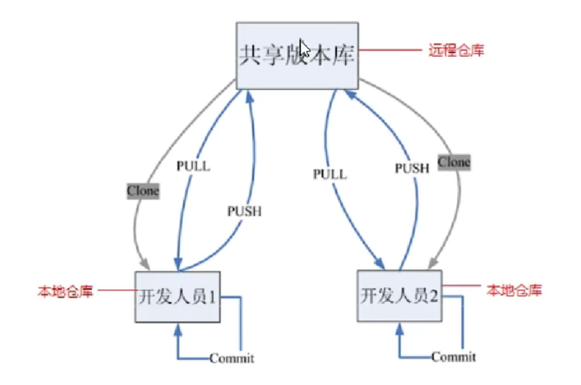
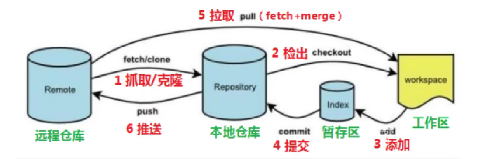
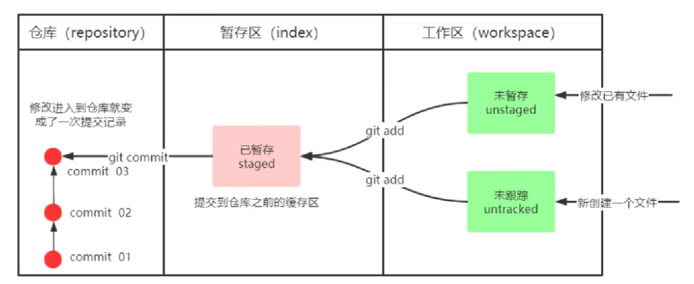

git add 此处接文件或文件名，不用引号 （此处文件名换成 "." 或 * ，则代表整个文件都进行同步）  
git commit -m 此处接文件或文件名 （同时该处文件名也要换成 "." 或 *  ）  
git push origin main (可以只输入git push)  
句子后紧跟着两个空格，默认换行  
### git工作原理  
  
### git工作流程图  
  

### git基础命令  
`git config --global user.name` # 查看git用户名  
`git config --global user.email` # 查看用户邮箱  

`git config --global user.name "user_name"` # 修改用户名  
`git config --global user.email "user_email"` #修改邮箱  

  
git add (工作区 --> 暂存区)  
git commit (暂存区 --> 本地仓库)  
